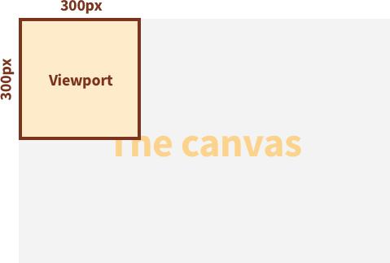
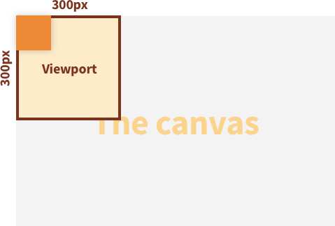
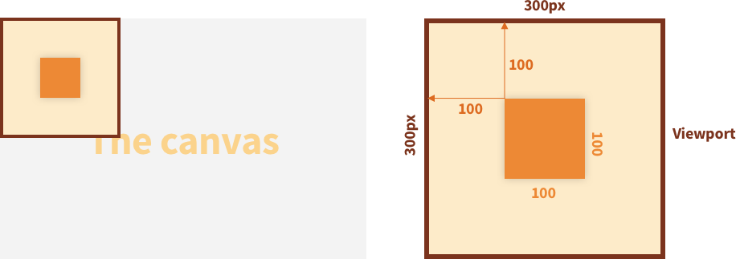
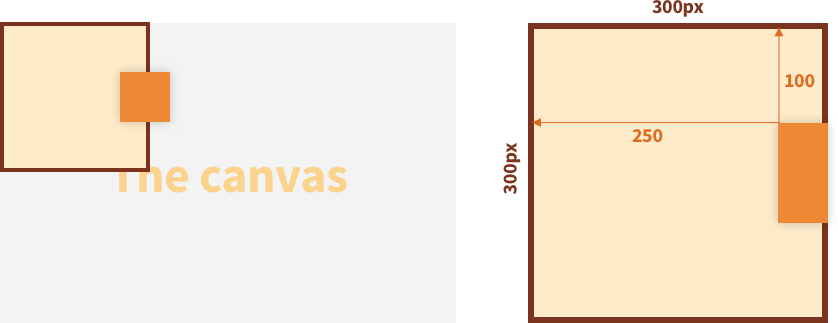
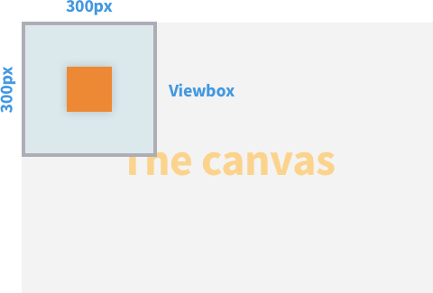
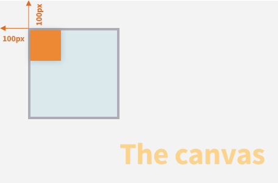
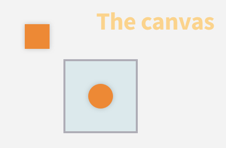
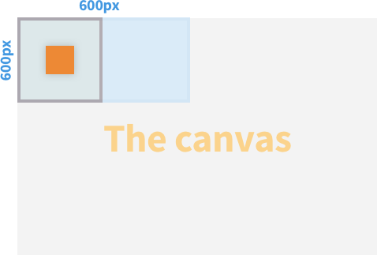

import { Spacer, Codepen } from "../components/post";

In this article we are going to discuss the SVG Viewport and viewBox. Both are important concepts to understand if you want to level up your understanding of SVGs. We are going to start by discussing how the SVG Viewport works as it is an essential prerequisite to understanding the SVG viewBox.


### Before we discuss the SVG viewBox, we first must understand how the SVG Viewport works.

When you add an SVG element to the DOM it brings along its own canvas, this canvas has an infinite width and height and is where all child elements of the SVG live (e.g. a circle or a square). The elements contained within the SVG could appear anywhere within this infinite canvas. This might seem a little conceptually strange at first - how could we possibly visualise an infinite canvas on a web page?!


We couldn't possibly display an infinite SVG canvas on a web page, so we need a way of defining what area of the canvas to display to our users. This is where the SVG Viewport comes in, **you can think of the Viewport as a window used to view a specific area of the canvas.**

<Spacer />

## The SVG Viewport

The SVG Viewport is easier to understand with a few examples, so let's start with something simple. Here we are defining an SVG element and setting it's Viewport width and height by applying the width and height attribute directly to the SVG.

```html
<svg width="300" height="300"></svg>
```

Setting the width and height attributes of an SVG element specifies the dimensions of the SVG Viewport. With a Viewport set to 300px by 300px we are essentially asking to view an area of the canvas with these dimensions. By default, our Viewport will sit at the top left of the canvas (we will explore later how to move its position).




<Spacer space="3" />

### Adding elements to the SVG canvas

Now that we have defined our Viewport, we can start adding elements to our SVG canvas. Lets start by adding a simple rectangle element that has a width and height of 100px:

```html
<svg width="300" height="300">
  <rect width="100" height="100" />
</svg>
```





As you can see, although we are adding the rectangle to the canvas, we are viewing it via the Viewport. Bear in mind that although the rectangle is only 100px in width and height, the entire SVG element will still take up a space of 300px by 300px within your webpage as that is the size of our viewport.

<Spacer space="3" />

### Moving elements around the SVG canvas

We can also move the rectangle to a different position on the canvas by applying an `x` and `y` value. You will notice that although we are moving the rectangle around the canvas, our viewport stays in the exact same place. Therefore, as long as we don't move the rectangle to a position outside of the viewport, it will remain visible.

```html
<svg width="300" height="300">
  <rect width="100" height="100" x="100" y="100" />
</svg>
```




You may have already figured out that if we move the rectangle to a position on the canvas that is not visible by the viewport, it will simply go out of view.

```html
<svg width="300" height="300">
  <rect width="100" height="100" x="250" y="100" />
</svg>
```



<Spacer />

## The SVG viewBox

Now that we have covered the basics of the SVG Viewport, it is time to take a dive into the SVG viewBox. We have already defined our SVG Viewport which gives us a window onto our canvas to view our rectangle. However, thus far our Viewport has only displayed the top left corner of the canvas. What if we want our Viewport to display a different area of the canvas? That is where viewBox comes in.

The SVG viewBox is used to set what area of the canvas to make visible through the Viewbox. To define the viewBox of our SVG element we need add the `viewBox` attribute. The viewBox accepts 4 values, each separated by a space or a comma.

The 4 values of viewBox represent:


  1. The `x` value of the viewBox, which sets where the viewBox is positioned on the x-axis of the canvas
  2. The `y` value of the viewBox, which sets where the viewBox is positioned on the y-axis of the canvas
  3. The `width` of the viewBox
  4. The `height` of the viewbox

Here is what our SVG looks like with the `viewBox` attribute:

```html
<svg width="300" height="300" viewBox="0 0 300 300">
  <rect width="100" height="100" x="100" y="100" />
</svg>
```

In this example, we are setting the width, height and starting position of the viewBox to match that of the SVG Viewport. Therefore, we do not see any visual changes:




<Spacer space="3" />

### Moving the viewBox

We can adjust the `x` and `y` values of our SVG viewBox in order to change its position within the canvas. By moving the position of our viewBox on the canvas, we are able to change what area of the canvas is visible within the Viewport. Remember, the rectangle lives on the canvas and its position is not changed when we amend the viewBox values.

```html
<svg width="300" height="300" viewBox="100 100 300 300">
  <rect width="100" height="100" x="100" y="100" />
</svg>
```





We could have multiple elements on our canvas, so we can move the viewBox in order to bring these elements into view:

```html
<svg width="300" height="300" viewBox="250 250 300 300">
  <rect width="100" height="100" x="100" y="100" />
  <circle cx="400" cy="400" r="50" />
</svg>
```

In this example, the rectangle is still on our canvas but we have moved the viewBox to display a different area of the canvas that contains a circle.




<Spacer space="3" />

### Adjusting the canvas "zoom" with SVG viewBox

Now that we are comfortable with the x and y values of viewBox, lets take a deeper dive into the width and height values. So far, we have only set the width and height of our viewBox to match that of our Viewport. The behavior of these values can be a little tricky to understand, so I will try to explain it as best I can.

> The width and height values of the viewBox define how many pixels of the canvas should be visible within the Viewport. Changing these viewBox values does not change the width and height of the Viewport on the page.

For example, if we leave our Viewport with a width and height of 300px but increase the width of our viewBox to 600px, we can see a 600px wide area of the canvas within our 300px wide Viewport:

```html
<svg width="300" height="300" viewBox="0 0 600 300">
  <rect width="100" height="100" x="100" y="100" />
</svg>
```




The same behavior applies to the viewBox height. If we define a viewBox height of 1000px we are going to see 1000px of the canvas squeezed into our Viewport that has a height of 300px:

```html
<svg width="300" height="300" viewBox="0 0 600 1000">
  <rect width="100" height="100" x="100" y="100" />
</svg>
```

<Spacer space="3" />

### Zooming out of the canvas using SVG viewBox

As you might expect, using a viewBox width or height that is less than that of the Viewport will have the opposite effect and will "zoom in" to the canvas.  Although the width and height of our Viewport is still 300px, we are asking to display an area of the canvas that is 150px by 150px.

```html
<svg width="300" height="300" viewBox="0 0 150 150">
  <rect width="100" height="100" x="0" y="0" />
</svg>
```


In this example, the dimensions of the rectangle have not changed at all. Instead, we are telling the viewBox to only include an area of the canvas that is 150px by 150px, but as our Viewport is 300px by 300px  this "zoom" effect is created.

You might be wondering when you would need to adjust the “zoom” of the viewBox, the most common use case is for SVG sprites. SVG sprites are basically a collection of SVG elements on a large canvas (usually icons). By utilizing the properties of viewBox we can define which asset to make visible Within the SVG canvas without having to import each SVG element individually.

<Spacer />

## Conclusion

Before taking the time to learn how the SVG viewBox worked I would find myself blindly updating it's values to get the result I needed. Today, I can feel more confident when approaching SVGs and I hope after reading this article you can too.